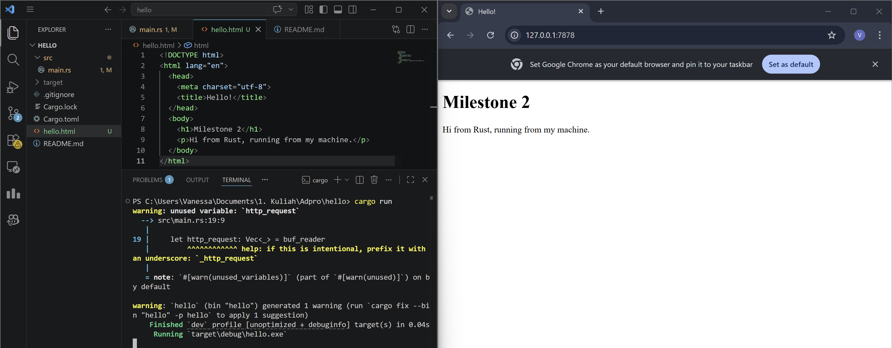
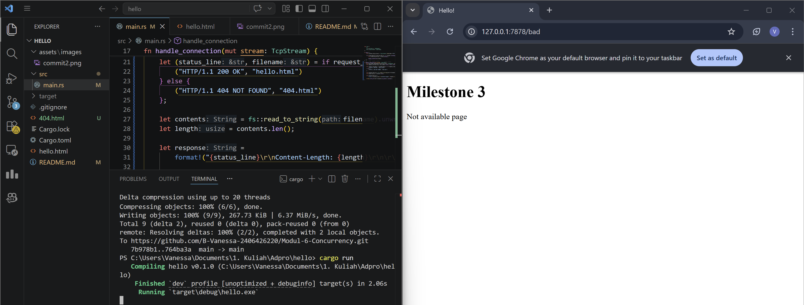

# Modul-6-Concurrency

### Commit 1 Reflection notes
Pada Milestone 1 ini, saya mempelajari bagaimana bahasa Rust menangani koneksi protokol TCP pada tingkat dasar menggunakan modul `TcpListener` dan `TcpStream`. Pada percobaan pertama, kode seolah tidak bekerja pada browser karena server hanya melakukan tahap handshake TCP tanpa membaca HTTP request sama sekali. Selain itu, koneksi langsung terputus saat variabel `stream` keluar dari scope, sehingga browser tidak menerima balasan apa pun dan hanya menampilkan halaman kosong.

Untuk mengatasi hal tersebut, fungsi `handle_connection` ditambahkan agar server mulai membaca aliran pesan dari browser. Agar pembacaan data lebih efisien, kita menggunakan tipe `BufReader` yang membungkus stream sehingga aliran teks mentah tersebut dapat dibaca baris demi baris secara optimal melalui fungsi lines(). Fungsi `lines()` mengembalikan sebuah iterator yang elemennya bertipe `Result<String, std::io::Error>`, yang kemudian diproses menggunakan metode `map` untuk mengekstrak nilai string murninya menggunakan `unwrap()`. Selanjutnya, operasi `take_while` digunakan untuk terus membaca stream tersebut sampai ditemukan sebuah baris kosong, yang mana di dalam protokol HTTP berfungsi sebagai penanda mutlak berakhirnya bagian header request. Terakhir, semua baris yang telah difilter dikumpulkan menjadi sebuah koleksi `Vec<_>` menggunakan fungsi `collect()` agar datanya bisa dicetak ke terminal dengan rapi. Hal ini memberikan saya pemahaman yang jelas tentang anatomi murni dari sebuah HTTP request sebelum diabstraksi oleh framework web tingkat tinggi.

---

### Commit 2 Reflection notes
Pada Milestone 2, kapabilitas server ditingkatkan sehingga tidak lagi hanya membaca request, tetapi sudah bisa membalasnya melalui file HTML. Sebuah HTTP response yang valid harus benar-benar mematuhi format teks dari protokol HTTP/1.1 yang ketat. Response tersebut harus selalu diawali dengan status line (seperti `HTTP/1.1 200 OK`), yang kemudian diikuti oleh baris HTTP headers seperti panjang konten (`Content-Length`). Setelah header, harus ada baris kosong ganda berupa karakter pengontrol `\r\n\r\n` (CRLF) yang bertindak sebagai pemisah mutlak, dan akhirnya barulah body dari response (berisi file HTML) disisipkan. Di dalam Rust, pembacaan file HTML eksternal dari ruang penyimpanan lokal dapat dilakukan dengan sangat mudah menggunakan utilitas fungsi `fs::read_to_string`. Setelah teks di dalam file dibaca dan panjang elemennya dihitung, blok response dirangkai menggunakan makro `format!`. Terakhir, string response tersebut dikonversi secara eksplisit menjadi sekumpulan byte array menggunakan metode `as_bytes()` karena fungsi `write_all` pada objek `TcpStream` mensyaratkan transfer data dalam format byte stream mentah ke network socket.

---

### Commit 3 Reflection notes
Milestone 3 memperkenalkan logika routing dasar pada server dengan cara memvalidasi baris pertama dari sebuah HTTP request, yaitu request line. Mekanismenya bekerja dengan cara memeriksa secara spesifik apakah request line tersebut sama persis dengan rute `"GET / HTTP/1.1"`. Jika hasil evaluasinya salah, server diprogram untuk secara otomatis membalas dengan status 404 NOT FOUND beserta halaman HTML kustom (404.html) untuk peringatan tersebut. Di samping logika kondisional, pada bagian ini saya juga menerapkan refactoring kode yang esensial demi mematuhi prinsip Clean Code, khususnya DRY (Don't Repeat Yourself). Alih-alih menulis ulang seluruh blok kode perakitan HTTP response pada setiap cabang if-else, saya hanya mengekstrak nilai variabel spesifik yaitu `status_line` dan `filename` ke dalam tuple variable bindings. Setelah tuple tersebut dievaluasi, eksekusi kode di bawahnya akan secara universal menangani pembacaan file dan pengiriman response yang sesuai terlepas dari cabang mana yang dipilih. Refactoring ini sangat memabntu membuat kode menjadi jauh lebih terstruktur, ringkas, serta meminimalisir peluang modifikasi yang tertinggal jika nanti harus mengelola puluhan routes tambahan.

---
